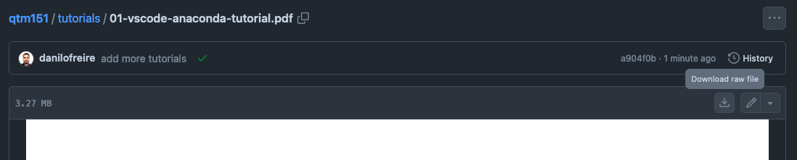

# QTM151 Tutorials

This folder contains several tutorials for the QTM151 course. Below you will find a list of available tutorials with links to both PDF and QMD versions where applicable.

## Available Tutorials

- [01 - VSCode and Anaconda Tutorial](01-vscode-anaconda-tutorial.pdf) ([QMD version](01-vscode-anaconda-tutorial.qmd))
- [02 - Jupyter Notebook and Markdown Tutorial](02-jupyter-markdown-tutorial.pdf) ([QMD version](02-jupyter-markdown-tutorial.qmd))
- [03 - GitHub Tutorial](03-github-tutorial.pdf) ([QMD version](03-github-tutorial.qmd))
- [04 - PostgreSQL Tutorial](04-postgresql-tutorial.pdf) ([QMD version](04-postgresql-tutorial.qmd))

## File Formats

- **PDF files**: These contain the final version of the tutorials with images and complete output. They are ideal for reading and following along.
- **QMD files**: These include the source code used to write the tutorials. They are [Quarto](https://quarto.org/) files, a Markdown-based document format that allows for code cells and other features. They are provided for those who want to learn more about the Markdown syntax and how to create similar documents for their own projects.

## How to Read the PDF Files on GitHub

You can either read the tutorials directly on GitHub or download them to your computer. To read them on GitHub, click on the links above and you will see them in an embedded viewer. You can also click on the download icon to save the raw files to your computer.

## Additional Resources

- `article-template.latex`: A LaTeX template for articles
- `python-postgresql-example.ipynb`: A Jupyter Notebook with a PostgreSQL example
- `testing-ipython`: A Jupyter Notebook for showing Markdown and code cells
- `testing-anaconda.py`: A Python script for testing Anaconda installation
- `.gitignore`: Git configuration file to specify intentionally untracked files

For any questions or issues regarding these tutorials, please open an issue in the main repository or email me at [danilo.freire@emory.edu](mailto:danilo.freire@emory.edu). I hope you like the tutorials and find them useful! :smiley:
